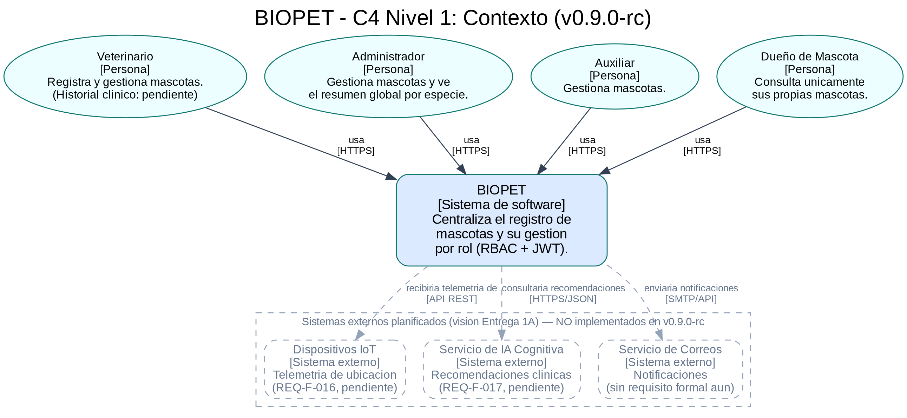

## C4 Nivel 1 — Contexto

### Objetivo

Este documento describe el **diagrama de contexto (C4 Nivel 1)** de BIOPET.
Su alcance es el más externo del modelo C4: muestra el sistema como una
única caja, quiénes lo usan (actores humanos) y con qué sistemas externos
se comunica, sin entrar en contenedores internos (eso lo cubre el
C4 Nivel 2, `docs/diagrams/c4-contenedores/`) ni en componentes del backend
(C4 Nivel 3, `docs/diagrams/c4-componentes-backend/`).

### Alcance real vs. alcance planificado

Este diagrama distingue explícitamente dos cosas, para no sobre-declarar
funcionalidad que el código no tiene todavía:

- **Actores humanos (trazo sólido):** los cuatro roles reales del sistema
  (`ROLE_ADMIN`, `ROLE_VETERINARIO`, `ROLE_AUXILIAR`, `ROLE_DUENO`),
  verificados contra `entity/Rol.java` y las anotaciones `@PreAuthorize` de
  `MascotaController`. Todos usan BIOPET vía HTTPS.
- **Sistemas externos (trazo punteado, agrupados aparte):** Dispositivos
  IoT, Servicio de IA Cognitiva y Servicio de Correos, heredados de la
  visión original de la Entrega 1A (`PFC_Entrega1A_BMT.pdf`, Figura 1). Se
  muestran porque forman parte de la visión de producto y están referenciados
  desde requisitos ya documentados en el SRS (REQ-F-016, REQ-F-017), pero
  **ninguno está implementado en v0.9.0-rc** — no existe código de
  integración con ninguno de los tres. Se marcan con línea punteada y una
  nota explícita para que el diagrama no de a entender más de lo que el
  sistema realmente hace hoy.

### Diagrama



Fuente editable: [`c4-contexto.dot`](c4-contexto.dot) (Graphviz, formato
consistente con el resto de diagramas del repositorio) y
[`c4-contexto.puml`](c4-contexto.puml) (PlantUML, mismo contenido).

### Regenerar el PNG

```bash
dot -Tpng docs/diagrams/c4-contexto/c4-contexto.dot -o docs/diagrams/c4-contexto/c4-contexto.png
```

### Trazabilidad

- Actores → `entity/Rol.java`, `MascotaController` (`@PreAuthorize`).
- Dispositivos IoT → REQ-F-016 (SRS.md, pendiente) / HU-015 / CU-15.
- Servicio de IA Cognitiva → REQ-F-017 (SRS.md, pendiente) / HU-016 / CU-16.
- Servicio de Correos → mencionado en la Entrega 1A (RF-07 original), sin
  requisito REQ-F formal propio todavía en el SRS de la Tercera Entrega —
  se deja como observación abierta, no se inventa un identificador nuevo
  sin que el equipo decida antes si se retoma para la Entrega Final.
