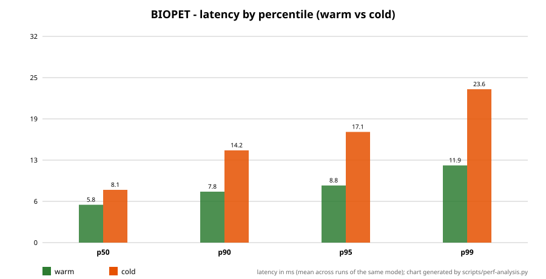

# Reporte de rendimiento — BIOPET (k6)

Metodo de intervalo de confianza: distribucion t de Student (scipy.stats.t), apropiada para el tamano de muestra de estas corridas.

| Corrida | n | Media (ms) | Mediana (ms) | DE (ms) | IC95% (ms) | p50 | p90 | p95 | p99 | Error (%) | Throughput (req/s) |
|---|---|---|---|---|---|---|---|---|---|---|---|
| k6-20260903T183212-local-tls-v1.0.0-caliente-01.json | 3217 | 8.66 | 7.59 | 7.62 | [8.4, 8.93] | 7.59 | 12.38 | 15.06 | 20.56 | 0.0 | 91.83 |
| k6-20260903T183852-local-tls-v1.0.0-frio-01.json | 3211 | 9.33 | 8.06 | 15.61 | [8.79, 9.87] | 8.06 | 12.71 | 15.31 | 21.1 | 0.0 | 91.65 |
| k6-20260903T183301-local-tls-v1.0.0-caliente-02.json | 3236 | 7.0 | 6.68 | 4.71 | [6.83, 7.16] | 6.68 | 8.61 | 9.48 | 13.06 | 0.0 | 92.35 |
| k6-20260903T184117-local-tls-v1.0.0-frio-02.json | 3216 | 9.09 | 7.82 | 15.68 | [8.55, 9.63] | 7.82 | 12.63 | 15.13 | 19.14 | 0.0 | 91.86 |
| k6-20260903T183427-local-tls-v1.0.0-caliente-03.json | 3236 | 5.48 | 5.27 | 4.73 | [5.32, 5.64] | 5.27 | 6.46 | 6.94 | 9.38 | 0.0 | 92.48 |
| k6-20260903T184249-local-tls-v1.0.0-frio-03.json | 3210 | 10.26 | 8.37 | 16.52 | [9.69, 10.83] | 8.37 | 15.64 | 18.23 | 25.89 | 0.0 | 91.57 |
| k6-20260903T183517-local-tls-v1.0.0-caliente-04.json | 3236 | 4.92 | 4.75 | 4.44 | [4.76, 5.07] | 4.75 | 5.76 | 6.04 | 8.79 | 0.0 | 92.62 |
| k6-20260903T184420-local-tls-v1.0.0-frio-04.json | 3211 | 9.88 | 7.84 | 17.75 | [9.27, 10.5] | 7.84 | 15.23 | 18.56 | 26.05 | 0.0 | 91.57 |
| k6-20260903T183633-local-tls-v1.0.0-caliente-05.json | 3246 | 5.04 | 4.89 | 4.55 | [4.88, 5.2] | 4.89 | 6.02 | 6.48 | 7.68 | 0.0 | 92.61 |
| k6-20260903T184614-local-tls-v1.0.0-frio-05.json | 3207 | 10.13 | 8.54 | 17.37 | [9.52, 10.73] | 8.54 | 14.88 | 18.03 | 25.97 | 0.0 | 91.52 |

## Wilcoxon pareado (caliente vs frio)

Pareo por indice de llegada (truncando al menor tamano de muestra). Tamano de efecto r de Rosenthal (r = Z / sqrt(n)).
Correccion por comparaciones multiples: Holm-Bonferroni (alfa=0.05, m=5).
Nota metodologica: las corridas son independientes; el pareo por indice de llegada no constituye un diseno pareado verdadero. Ver analisis de sensibilidad abajo.

| Par | W | p (original) | p (ajustado Holm) | Significativo (Holm) | r |
|---|---|---|---|---|---|
| local-tls-v1.0.0-01 | 1833064.5 | 1.10e-45 | 1.10e-45 | Si | -0.2504 |
| local-tls-v1.0.0-02 | 1189148.0 | 3.88e-155 | 7.75e-155 | Si | -0.4679 |
| local-tls-v1.0.0-03 | 99000.0 | p < 2.23e-308 | p < 2.23e-308 | Si | -0.8328 |
| local-tls-v1.0.0-04 | 58374.0 | p < 2.23e-308 | p < 2.23e-308 | Si | -0.8465 |
| local-tls-v1.0.0-05 | 41669.5 | p < 2.23e-308 | p < 2.23e-308 | Si | -0.8521 |

## Sensibilidad: Mann-Whitney U (muestras independientes)

Analisis de sensibilidad sin asumir pareo por indice (corridas independientes). Tamano de efecto r = Z / sqrt(N).

| Par | U | p | r |
|---|---|---|---|
| local-tls-v1.0.0-01 | 4412540.0 | 4.82e-24 | -0.1261 |
| local-tls-v1.0.0-02 | 2929640.0 | 6.30e-203 | -0.3784 |
| local-tls-v1.0.0-03 | 548681.0 | p < 2.23e-308 | -0.7745 |
| local-tls-v1.0.0-04 | 319349.0 | p < 2.23e-308 | -0.8127 |
| local-tls-v1.0.0-05 | 282984.0 | p < 2.23e-308 | -0.8189 |

## Grafico

